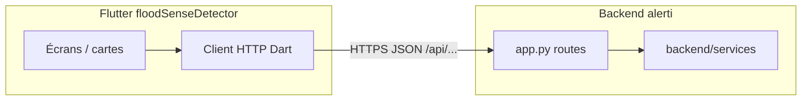

# Connexion Flutter → services Alerti (via API REST)

## Contexte technique important

Les classes dans [alerti/backend/services/](file:///Users/macpro/IdeaProjects/alerti/backend/services/) (ex. `weather_forecast_service.py`, `bamako_prediction_service.py`) sont du **Python serveur**. Flutter **ne peut pas** les importer ou les exécuter localement. Elles sont déjà branchées sur l’API dans [alerti/app.py](file:///Users/macpro/IdeaProjects/alerti/app.py) : chaque route HTTP appelle le service correspondant et renvoie du JSON.

## Ce qui existe déjà

- **Flask** : CORS activé (`CORS(app)`), port par défaut 5000 en local ([app.py](file:///Users/macpro/IdeaProjects/alerti/app.py) lignes 63–75, 597–600).
- **Routes utiles** (non exhaustif) : `POST /api/predict`, `POST /api/predict-meteo`, `POST /api/bamako/predict`, `GET /api/alerts`, `GET /api/forecast/<country>`, `GET /api/mali/neighborhoods`, `GET|POST` prédictions quartier, `POST /api/subscribe/push`, etc. (voir `@app.route` dans [app.py](file:///Users/macpro/IdeaProjects/alerti/app.py)).
- **Flutter** : dépendance `http` déjà présente ([pubspec.yaml](file:///Users/macpro/StudioProjects/floodSenseDetector/pubspec.yaml)) ; URL de base centralisée dans [lib/core/constants/app_config.dart](file:///Users/macpro/StudioProjects/floodSenseDetector/lib/core/constants/app_config.dart) et surcharge possible via [lib/core/services/config_service.dart](file:///Users/macpro/StudioProjects/floodSenseDetector/lib/core/services/config_service.dart) (`getBaseUrl()`).

## Implémentation recommandée (Flutter)

1. **Créer un client dédié** (ex. `lib/features/flood_prediction/data/services/alerti_flood_api_service.dart` ou sous `lib/core/services/`) qui :
   - Utilise **`${ConfigService().getBaseUrl()}`** comme racine (cohérent avec votre choix : même hôte que `https://alerti.marakadev.online`).
   - Expose des méthodes claires : `predictFlood({lat, lon, location, country})` → `POST /api/predict` avec le corps JSON attendu par Flask ; `predictBamako({commune, neighborhood})` → `POST /api/bamako/predict` ; `getCountries()` → `GET /api/countries` ; etc.
   - En-têtes : `Content-Type: application/json`, `Accept: application/json` (comme [lib/core/services/api_service.dart](file:///Users/macpro/StudioProjects/floodSenseDetector/lib/core/services/api_service.dart)).
   - Gestion d’erreurs : codes 4xx/5xx, corps `{"error": "..."}` renvoyé par Flask.

2. **Modèles de réponse** : commencer par `Map<String, dynamic>` via `jsonDecode` pour aller vite ; ajouter des classes Dart (`freezed` / `json_serializable`) seulement si vous voulez un typage strict sur les champs `prediction`, `risk_level`, etc.

3. **Brancher l’UI** : depuis l’écran carte Bamako ou un écran “prévision” ([lib/features/maps/](file:///Users/macpro/StudioProjects/floodSenseDetector/lib/features/maps/)), appeler le service au lieu de données statiques uniquement, selon les flux que vous priorisez (ex. prédiction quartier + liste pays).

## Vérification côté déploiement (hors code Flutter)

- Confirmer que **`https://alerti.marakadev.online/api/predict`** (ou `/`) répond bien comme le Flask local (même schéma JSON). Si une route renvoie 404, le reverse proxy ne route peut‑être pas encore ce préfixe vers Flask — à corriger côté infra, pas dans Dart.
- Les prédictions Bamako nécessitent que le serveur charge les modèles (sinon Flask renvoie **503** “service not available” — déjà géré dans [app.py](file:///Users/macpro/IdeaProjects/alerti/app.py) pour `bamako_prediction_service`).

## Fichiers principaux à toucher

| Rôle | Fichier |
|------|---------|
| Référence des endpoints et corps JSON | [alerti/app.py](file:///Users/macpro/IdeaProjects/alerti/app.py) |
| Nouveau client API inondation | Nouveau `.dart` sous `floodSenseDetector/lib/...` |
| Config URL (déjà OK si même hôte) | [app_config.dart](file:///Users/macpro/StudioProjects/floodSenseDetector/lib/core/constants/app_config.dart) + [config_service.dart](file:///Users/macpro/StudioProjects/floodSenseDetector/lib/core/services/config_service.dart) |
| Intégration UI | Écrans concernés sous `lib/features/maps/` ou nouveau feature |

## Hors scope (sauf besoin explicite)

- Refactor Flask ou duplication des services.
- Deuxième `baseUrl` séparée : **non nécessaire** tant que toutes les routes Flask sont servies sous le même origine que vous utilisez déjà.
